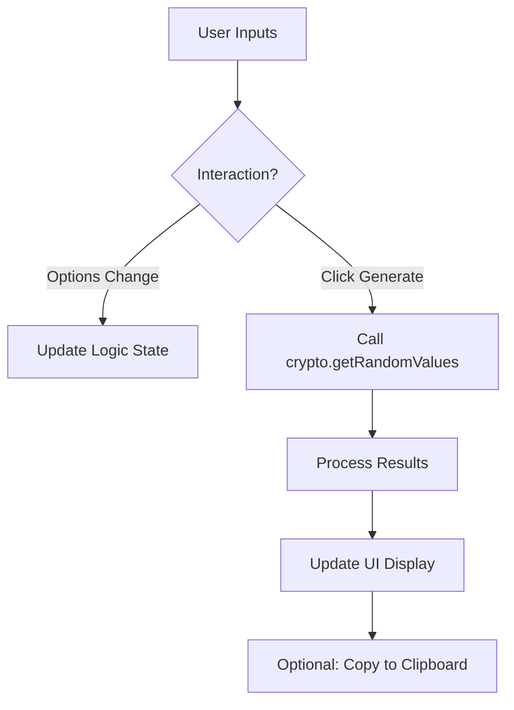

# Musakui — Random String & Number Generator

Musakui (Japanese for "random") is a clean, modern, and secure tool for generating random strings and numbers directly in your browser. It provides a highly customizable interface for everything from generating secure passwords to random sampling from a range.

[](https://musakui.yogu.one)
[](LICENSE)

## Purpose

The primary goal of Musakui is to provide a privacy-respecting and user-friendly way to generate random data. By performing all calculations locally using cryptographically strong APIs, it ensures that your sensitive generated data (like passwords) never leaves your device.

## Key Features

- **Random String Generator**: 
    - Customisable length and character sets (Uppercase, Lowercase, Numbers, Symbols).
    - Presets for Hexadecimal, Base64, and Secure Passwords.
- **Random Number Generator**: 
    - Flexible range selection (Min/Max).
    - Support for generating multiple numbers at once.
    - Option for unique results (no duplicates).
- **Privacy & Security**: Uses `crypto.getRandomValues()` for cryptographically strong randomness. All generation happens locally.
- **Dark Mode Support**: Automatically respects system preferences or allows manual toggling.
- **Mobile-First Design**: Fully responsive layout that works seamlessly across all device sizes.
- **Accessibility (A11y)**: Built with semantic HTML5 and follows WCAG standards for screen readers and keyboard navigation.

## Technology Stack

Musakui is built with a focus on simplicity and performance, using no external frameworks or heavy libraries:

- **HTML5**: Semantic markup for better accessibility and structure.
- **CSS3**: Modern CSS including Grid, Flexbox, and Custom Properties (Violet accent).
- **Vanilla JavaScript (ES6+)**: Native DOM manipulation and CSPRNG logic.
- **Deno**: Used for local development tools (server, formatting, and linting).

## Architecture

The following diagram illustrates the application flow:



## Requirements to Run

### For Users

No installation is required. You can simply open `web/index.html` in any modern web browser to use the tool.

### For Developers

To contribute or run the project locally with full tooling support, you will need:

- [Deno](https://deno.land/) (v1.30.0 or higher recommended)
- `make` (optional, for shortcut commands)

## Local Development

1. **Start the local server**:
   ```bash
   make serve
   ```
   Alternatively: `deno run --allow-net --allow-read serve.ts`

2. **Format source files**:
   ```bash
   make fmt
   ```

3. **Lint source files**:
   ```bash
   make lint
   ```

The server will be available at `http://localhost:8000`.

## Project Structure

```text
musakui/
├── web/
│   ├── index.html          # Main application shell
│   ├── css/
│   │   ├── variables.css   # Violet accent and Slate tokens
│   │   └── styles.css      # Component and layout styles
│   ├── js/
│   │   ├── musakui.js      # Generator logic and UI interactions
│   │   └── theme.js        # Dark mode toggle and persistence
│   └── assets/
│       └── musakui.png     # App logo
├── LICENSE                 # GNU GPL v3 Licence
├── Makefile                # Shortcut commands
├── README.md               # Project documentation
└── serve.ts                # Deno server script
```

## Licence

This project is licensed under the **GNU General Public License v3 (GPL-3.0)**. See the [LICENSE](LICENSE) file for details.
